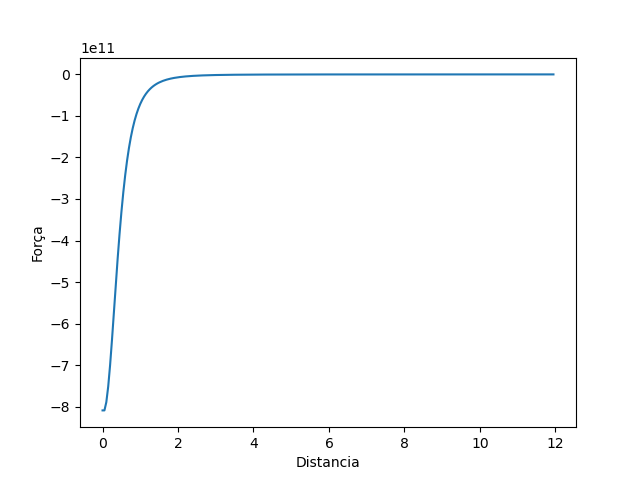
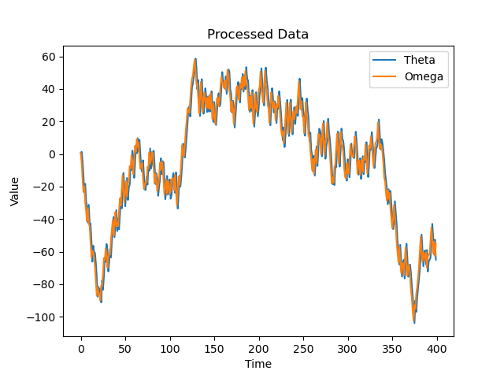
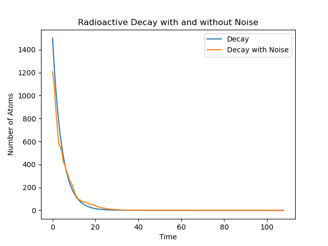
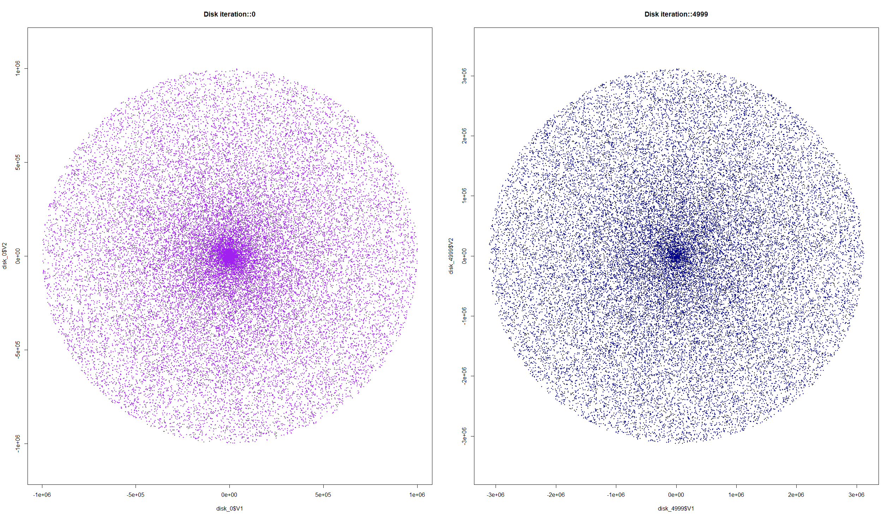

- ! Columb, um programinha simples em C e Python, que calcula a força eletrostatica entre:
    - 2 cargas pontuais;
    - 1 plano e uma carga pontual;
    - 1 toroide e uma carga pontual;

- ! Text Write Read, autoexplicativo, um programa para ler e escrever um .txt; 
- ! Pendulum, um programa que gera e simula o comportamento de N pendulos - pelo parametro que está no codigo, é apenas 1, mas você pode mudar-; 
- ! Radioactive_decay, simula o decaimento radioativo com e sem o "Noise". 
- ! Diskaccretion, simula um disco de accreção num potencial gravitacional de um buraco negro, possivelmente não funciona direito.

Fiz esse conjunto de pequenos projetos para estudar e praticar C e Python durante meu tempo livre